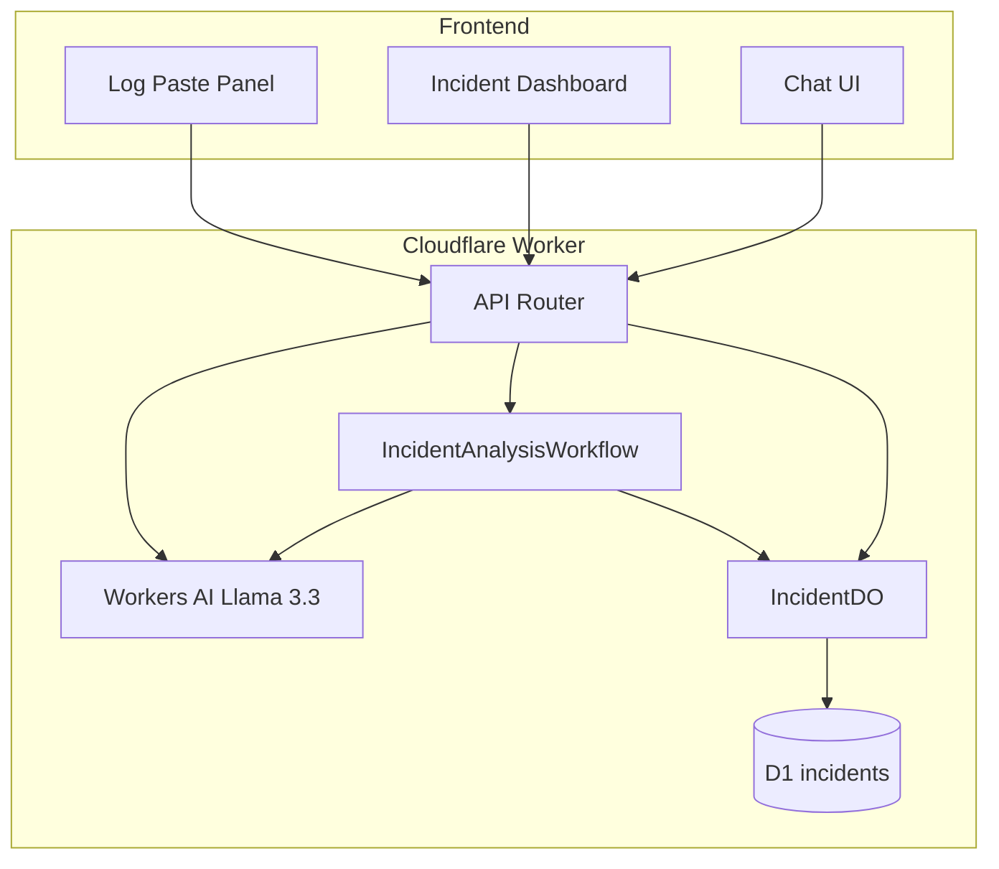

# IncidentAI — Architecture

## Overview

IncidentAI is an AI production debugging copilot on Cloudflare. Engineers paste alerts/logs (or load demo scenarios); a Worker starts a multi-step Workflow that analyzes logs, calls Workers AI (Llama 3.3), and stores incident memory in a Durable Object + D1.

## Cloudflare products used

| Product | Role |
| --- | --- |
| Workers | API + routing + static asset hosting |
| Workers AI | `@cf/meta/llama-3.3-70b-instruct-fp8-fast` for diagnosis + chat |
| Workflows | Durable multi-step incident analysis |
| Durable Objects | Per-incident live state + chat memory |
| D1 | Persistent incident / message / workflow history |
| Static Assets | React UI (Pages-equivalent hosting on the Worker) |

## Request flow

## Workflow steps

1. `collect_logs` — normalize pasted/scenario logs  
2. `analyze_errors` — deterministic ERROR/WARN/5xx/latency/pool parsing  
3. `identify_patterns` — map signals to candidate causes  
4. `llm_diagnosis` — Llama 3.3 structured diagnosis (JSON)  
5. `generate_remediation` — actionable checklist  
6. `final_report` — markdown report + status `diagnosed`

Each step uses `step.do` so failed LLM calls can retry without redoing earlier work.

## Memory model

- **Durable Object `IncidentDO`**: live status, metrics, diagnosis, remediation, messages  
- **D1**: durable rows for incidents, messages, workflow_runs (survives DO eviction)  
- **Chat**: system prompt injects current DO memory so “What did we determine?” works later  

## API

| Method | Path | Purpose |
| --- | --- | --- |
| GET | `/api/scenarios` | Demo scenarios |
| POST | `/api/incidents` | Create incident + start workflow |
| GET | `/api/incidents/:id` | Poll incident state |
| POST | `/api/incidents/:id/chat` | Streaming chat (SSE) |
| POST | `/api/incidents/:id/actions/:actionId/toggle` | Toggle remediation checkbox |
